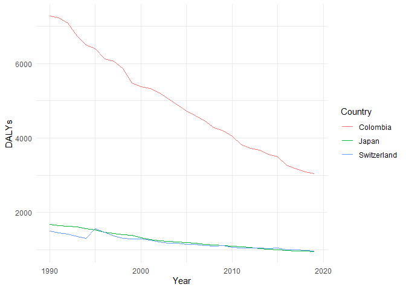

Global Disease Burden Analysis
================
Ornella

# Introduction

This document compares the Disability-Adjusted Life Year (DALY) diseases
burden for three countries: Colombia, Switzerland, and Japan. We compare
the burden due to communicable, maternal, neonatal, and nutritional
diseases (CMNN), non-communicable diseases (NCDs), and overall disease
burden for these countries.

The source data is from the Institute for Health Metrics and Evaluation
(IHME) Global Burden of Disease (GBD) study.

# Communicable, Maternal, Neonatal, and Nutritional Disease Burden (CMNN)

## Table of Estimates for CMNN Burden Over Time

| Year | Colombia |     Japan | Switzerland |
|-----:|---------:|----------:|------------:|
| 1990 | 7275.468 | 1675.7707 |   1499.9792 |
| 1991 | 7231.688 | 1646.4943 |   1455.3930 |
| 1992 | 7080.091 | 1634.0107 |   1417.3056 |
| 1993 | 6738.438 | 1606.5737 |   1356.1228 |
| 1994 | 6500.664 | 1568.7557 |   1304.4203 |
| 1995 | 6398.454 | 1535.9674 |   1558.6748 |
| 1996 | 6124.491 | 1468.5303 |   1465.5185 |
| 1997 | 6054.719 | 1430.5855 |   1372.0308 |
| 1998 | 5871.907 | 1411.4048 |   1313.2029 |
| 1999 | 5483.131 | 1383.6155 |   1286.8233 |
| 2000 | 5383.338 | 1327.5424 |   1282.4212 |
| 2001 | 5335.518 | 1279.7103 |   1255.9620 |
| 2002 | 5214.290 | 1248.6345 |   1215.3329 |
| 2003 | 5058.455 | 1230.3399 |   1183.9231 |
| 2004 | 4886.009 | 1203.2242 |   1171.4344 |
| 2005 | 4733.884 | 1194.5089 |   1143.5562 |
| 2006 | 4605.434 | 1168.3218 |   1143.1385 |
| 2007 | 4454.917 | 1146.8287 |   1110.1040 |
| 2008 | 4278.630 | 1129.0598 |   1094.4056 |
| 2009 | 4198.258 | 1106.1977 |   1103.4031 |
| 2010 | 4052.605 | 1095.1670 |   1069.5194 |
| 2011 | 3814.584 | 1079.3234 |   1052.9461 |
| 2012 | 3731.865 | 1058.8803 |   1041.5221 |
| 2013 | 3677.910 | 1035.2016 |   1041.7970 |
| 2014 | 3568.548 | 1012.9629 |   1036.2483 |
| 2015 | 3505.624 |  993.2177 |   1039.1022 |
| 2016 | 3276.761 |  980.8555 |   1005.3160 |
| 2017 | 3171.656 |  958.3149 |    993.0077 |
| 2018 | 3089.418 |  958.4397 |    981.4799 |
| 2019 | 3043.929 |  957.1415 |    972.5998 |

## Plot Showing Trends in CMNN Burden Over Time

<!-- -->

## Summary of CMNN Burden Findings

Colombia shows declaining number of DALYs but is still facing a higher
number of DALYs copared to Switzerland and Japan.

# Non-Communicable Disease Burden (NCD)

## Table of Estimates for NCD Burden Over Time

## Plot Showing Trends in NCD Burden Over Time

## Summary of NCD Burden Findings

Provide a brief analysis based on the data presented in the table and
chart. Highlight any significant findings or patterns. About 3
sentences.

# Overall Disease Burden

## Table of Estimates for Overall Disease Burden Over Time

## Plot Showing Trends in Overall Disease Burden Over Time

## Summary of Overall Disease Burden Findings

Provide a brief analysis based on the data presented in the table and
chart. Highlight any significant findings or patterns. About 3
sentences.
